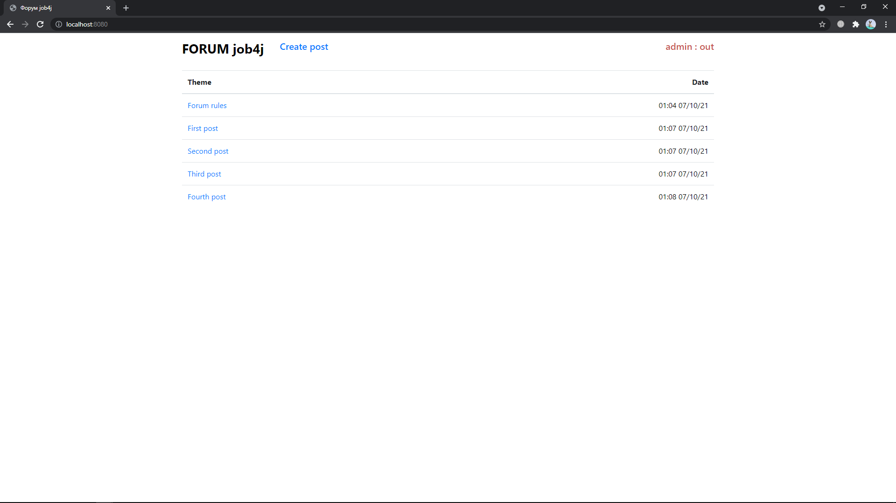

# JOB4J_FORUM
## Technologies
Spring (boot, security, data, tests), PostgreSQL, HTML, CSS.
### Libraries
JSTL, Liquibase. 
## Description
Web forum with authorization and registration, as well as the possibility of creating, editing posts and their subsequent discussion. The project is constantly being finalized.
## Images
#### Main page:

#### Post discussion page:

#### Registration:

#### Authorization:

#### Create page:

## Contacts

E-mail - pvzarea@gmail.com, telegram - @the_kyln